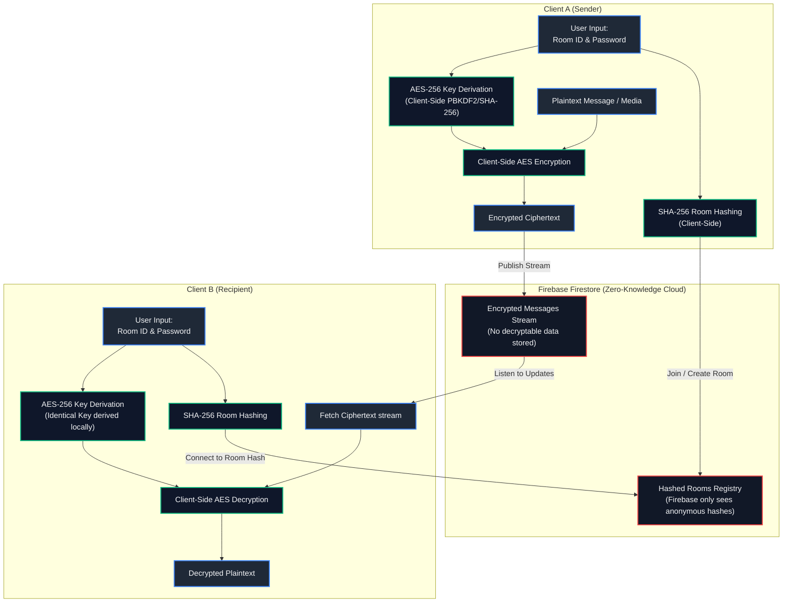

# Sessions — Private Secure Chat Rooms

Sessions is a premium, real-time anonymous messaging application built with Flutter and Firebase. Designed around a **Zero-Knowledge Architecture**, Sessions prioritizes user privacy and security above all else. Users can create or join temporary secure rooms using a unique combination of three English words and a password, ensuring complete anonymity with no personal identification, phone numbers, or metadata trace.


## 🔒 Security & Privacy Core

Sessions employs a state-of-the-art security suite to ensure conversations remain strictly confidential:

* **Zero-Knowledge Architecture:** No real identities, phone numbers, or email sign-ups are required. Room keys and passwords are never transmitted or stored in plain text.
* **End-to-End (E2E) Encryption:** Messages and shared images are encrypted client-side using the AES-256 algorithm via the `encrypt` package.
* **Derived Cryptographic Keys:** Decryption keys are derived dynamically on the user's device using a cryptographic combination of the room's three-word ID and password. Firebase never has access to the keys or the plaintext message content.
* **SHA-256 Room Hashing:** Room identifiers are hashed client-side with SHA-256 before interacting with the Firebase backend. The server only sees anonymous hashes, meaning database admins cannot know the names of active rooms.
* **Ephemeral "No Traces" Rooms:** Upon session deletion, all message logs, files, and room associations are immediately and permanently wiped from both local devices and Firebase servers.

---

## 📐 System Architecture

Sessions uses a decentralized, client-side cryptographic flow to ensure no plaintext information ever leaves the user's device:



---

## 📱 Screenshots

<p align="center" float="left">
  
  
  
  
</p>

---

## 🚀 Setup & Contributions

To set up the development environment locally:

1. **Clone & Setup:**
   ```bash
   git clone https://github.com/ArjunKVarma/Sessions-Chat_Rooms_an_Private_Messenger.git
   cd Sessions-Chat_Rooms_an_Private_Messenger
   ```
2. **Fetch Dependencies:**
   ```bash
   flutter pub get
   ```
3. **Configure Firebase:** Set up your Firebase project and add your `google-services.json` to the `android/app` directory.
4. **Run Application:**
   ```bash
   flutter run
   ```

*Thank you for contributing to keeping Sessions anonymous, secure, and lightning-fast!*
